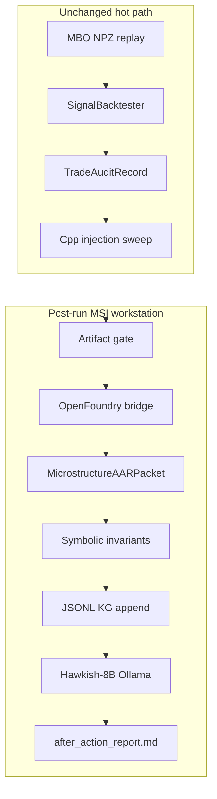

# HFT after-action layer — implementation plan

## Goal

After each **workbench** microstructure backtest completes, produce:

1. An **OpenFoundry-typed** knowledge-graph record (file-backed JSONL)
2. A **MicrostructureAARPacket** (structured JSON, PDF-cited, ns/µs disciplined)
3. A **symbolic invariant pass** (AlphaGeometry neuro-symbolic *pattern*, HFT numeric rules)
4. A **Hawkish-8B after-action report** (plain English + KG annotations)

All of the above run **post-run only** on the MSI workstation. Nothing in the MBO replay hot path, CHI404 capture path, or C++ gateway.

---

## Confirmed scope

| Decision | Choice |
|----------|--------|
| Trigger | End of [`WorkbenchEngine.run()`](workbench/src/run/engine.py) only — not campaign rollup, not `backtest_pipeline` CLI |
| Graph store | File-backed JSONL under `research_cards/kg/` (no Neo4j Phase 1) |
| LLM | Ollama `hf.co/QuantFactory/Llama-3.1-Hawkish-8B-GGUF:Q6_K` (~6.6 GB, local) |
| OpenFoundry source | [syzygyhack/open-foundry](https://github.com/syzygyhack/open-foundry) vendored — **not** Quant X `quant_data_refinery/` |
| Symbolic source | [google-deepmind/alphageometry](https://github.com/google-deepmind/alphageometry) vendored — **pattern only**, not geometry on order books |
| Quant X | Excluded (mission-control, training camp, advisory packets, JS runtime) |

---

## Sources of truth (do not invent parallel schemas)

| Layer | Location | Use |
|-------|----------|-----|
| OpenFoundry upstream | `vendor/openfoundry/` | Ontology types, connector contract, JSONL stream conventions |
| AlphaGeometry upstream | `vendor/alphageometry/` | Reference for LLM + symbolic verifier split |
| Mathematical PDFs | `docs/references/*.pdf` | Filtration, event-time, latency, validation — **every packet field cites MANIFEST** |
| hft3 execution | [`trade_audit.py`](workbench/src/core/trade_audit.py), `diagnostics.json`, `trades.parquet`, [`viability.py`](workbench/src/latency/viability.py) | Packet payload |
| Latency authority | [`LATENCY_ARCHITECTURE.md`](docs/workbench/LATENCY_ARCHITECTURE.md), [`cpp_latency_profile.yaml`](workbench/config/cpp_latency_profile.yaml), CHI404 `latency_summary.json` | µs promotion truth |

**Adapter rule:** `data_layer/` wraps vendors + PDFs + workbench artifacts. No greenfield ontology YAML that ignores `vendor/openfoundry/`.

---

## Original developer prompt → plan mapping

| Prompt § | Requirement | This plan |
|----------|-------------|-----------|
| 1 Domain ontology | Extend OpenFoundry with HFT concepts | Phase 1: read vendor schema + `hft3-cme-mbo.yaml` extensions |
| 2 KG ingestion | Graph from each backtest run | Phase 1–2: OpenFoundry-typed JSONL + per-run `kg_slice.json` |
| 3 Backtest→LLM packet | Timestamps, latencies, predictions, metrics, context | Phase 2: `MicrostructureAARPacket` |
| 4 Local LLM | Hawkish-8B interprets packet; narrative + annotations | Phase 4 (after Phase 3 symbolic) |
| 5 Integrate backtester | End-of-run hook; persist report + KG | Phase 5: `engine.py` hook |
| 6 Visualization | Report tab shows metrics + narrative | Phase 6: Streamlit Report tab |
| 7 Continuous learning | KG query for similar runs | Phase 2: `find_similar_runs(event_context, latency_lane)` |
| 8 Validation | HFT simulation standards; LLM does not fix flaws | Pass B + symbolic pass + fidelity flags |

---

## Grader non-negotiables (HFT ms/µs/ns)

- **Exchange timestamps:** nanoseconds on all event/fill fields
- **Latency budgets:** microseconds for C++ chain, injection sweep, composition phase stubs
- **`python_research_runtime_us`:** logged as **non-authoritative** — never used for promotion narrative
- **`per_trade_audit[]`:** required when `num_trades > 0` (from `trades.parquet`)
- **`injection_sweep`:** full µs grid from diagnostics — not subsampled
- **Walk-forward:** LLM suggestions tagged `discovery_only` — no holdout retuning
- **Simulation honesty:** `cpp_replay_available: false` must appear in narrative when stub; LLM cannot compensate

---

## Phase 0 — Vendor repos + PDF manifest

### Directory layout

```text
hft3/
  vendor/
    openfoundry/              # submodule → https://github.com/syzygyhack/open-foundry
    alphageometry/            # submodule → https://github.com/google-deepmind/alphageometry
  integrations/openfoundry/
    hft3-cme-mbo.yaml         # CME MBO microstructure asset-class connector
    README.md
    VENDOR.lock               # pinned SHAs for both submodules
  docs/references/
    MANIFEST.md               # field/class → pdf + section
    README.md                 # update with full bundle list
  data_layer/                 # hft3 adapter (see below)
  research_cards/kg/
    nodes.jsonl
    edges.jsonl
```

### Submodule init (implementation step)

```bash
git submodule add https://github.com/syzygyhack/open-foundry vendor/openfoundry
git submodule add https://github.com/google-deepmind/alphageometry vendor/alphageometry
```

Record resulting commit SHAs in `integrations/openfoundry/VENDOR.lock`.

### PDF bundle

**Present:** `algorithmic_trading_strategy_development.pdf`, `hft_framework_developer_prompt.pdf`

**Required per [`REVIEWER_CHARTER.md`](docs/REVIEWER_CHARTER.md)** — copy into `docs/references/` before claiming `packet_valid`:

- `chicago_cme_microstructure_mathematical_model.pdf`
- `chicago_cme_microstructure_a_plus_developer_handoff.pdf`
- `chicago_cme_a_plus_production_implementation_prompt.pdf`
- `rithmic_trial_hftbacktest_pipeline_prompt.pdf`
- `Ultimate_Quantitative_Finance_Researcher.pdf`

`MANIFEST.md` is the grader index: missing PDF → packet may build but `pdf_citations_complete: false` → LLM skipped.

---

## Phase 1 — OpenFoundry bridge + KG ingest

### Connector [`integrations/openfoundry/hft3-cme-mbo.yaml`](integrations/openfoundry/hft3-cme-mbo.yaml)

- `asset_class: cme_mbo_microstructure`
- `upstream: https://github.com/syzygyhack/open-foundry`
- Artifact root: `research_cards/workbench_runs/` (local paths, not Quant X S3)
- Maps OpenFoundry `backtest-run` stream to hft3 run artifacts

### HFT ontology extensions (on top of vendor types)

| Extension | Time unit | Source |
|-----------|-----------|--------|
| `MarkedMicroEvent` | ns | MBO NPZ window around worst-latency fill |
| `BookSnapshotAtDecision` | ns | [`OrderBook`](features_engine/src/features/mbo_features.py) |
| `QueuePositionEstimate` | — | [`queue_tracker.py`](workbench/src/sim/queue_tracker.py) or `missing` |
| `LatencyChainUs` | µs | [`TradeAuditRecord`](workbench/src/core/trade_audit.py) |
| `CppLatencyBudget` | µs | CHI404 profile + yaml defaults |
| `InjectionSweepResult` | µs keys | `diagnostics.json` |
| `StrategySignal` | — | signal raw/adjusted; `composition_trace.json` |
| `FillOutcome` | ns fill_ts | fills / trades.parquet |
| `EventContext` | — | CPI_TIGHT / NFP_TIGHT, symbol, walk-forward stage |

### `data_layer/` modules

```text
data_layer/
  openfoundry_bridge.py       # load vendor schema; validate connector
  ingest_run.py               # artifact_dir → nodes.jsonl / edges.jsonl
  packet/
    microstructure_aar_packet.py
    schema_v1.json
  symbolic/
    latency_invariants.py
  llm/
    ollama_client.py
    prompts.py
  pipeline/
    after_action.py             # orchestrator
  kg/
    store.py
    query.py                    # find_similar_runs()
  tests/
```

---

## Phase 2 — `MicrostructureAARPacket`

Read-only assembly from `artifact_dir` after backtest completes.

### Required sections

1. **`openfoundry_meta`** — connector id, vendor SHA, schema_version
2. **`pdf_citations[]`** — from MANIFEST
3. **`event_context`** — event_id, event_state, data_sufficient, catalog_years
4. **`latency_authority`** — p99_us, breakeven_us, buffer_us, lane_required, lane_pass, survives_cpp; python runtime flagged non-authoritative
5. **`injection_sweep`** — complete µs → PnL map
6. **`per_trade_audit[]`** — when trades > 0: ns timestamps + µs chain per [`trade_audit.py`](workbench/src/core/trade_audit.py)
7. **`simulation_fidelity`** — cpp_replay stub, [`matching_config.yaml`](workbench/src/sim/matching_config.yaml), queue_tracker status
8. **`predictions_vs_outcomes`** — signal vs fill direction; composition veto; adverse_selection_ticks

### Optional

- `composition_trace` — phase budgets µs
- `decision_point_events[]` — capped MBO slice around max tick_to_ack trade

### Skip rules (still write meta + partial packet)

| Condition | `skip_reason` |
|-----------|---------------|
| `data_sufficient == false` | `HISTORY_GATE` |
| trades > 0 but no audit fields | `AUDIT_INCOMPLETE` |
| Ollama unreachable | `LLM_UNAVAILABLE` (symbolic + KG still run) |

---

## Phase 3 — Symbolic pass (AlphaGeometry pattern)

**Vendored:** [alphageometry](https://github.com/google-deepmind/alphageometry) — neuro-symbolic: verifier + language model.

**hft3 does not** feed order-book geometry into AG's DDAR engine. **hft3 does** implement `latency_invariants.py` using the same **order of operations**:

1. Symbolic checks on packet (deterministic)
2. Only if symbolic pass (or with explicit violations listed) → Hawkish-8B

### Obligations (initial set)

- `tick_to_ack_us ≈ feed + decision_compute + decision_to_send + send_to_ack`
- `decision_end_ts_ns >= market_data_receive_ts_ns`
- `fill_ts_ns >= order_send_ts_ns` when fill present
- `lane_pass` ⇒ `latency_profitability_buffer_us > 0`
- `promote_candidate` ⇒ `survives_cpp_execution_delay` and robustness passed (cross-check diagnostics)

**Output:** `after_action_symbolic.json` → `{passed, obligations[], violations[]}`

---

## Phase 4 — Hawkish-8B narrative

- **Host:** MSI workstation Ollama only (BLUEPRINT §4)
- **Model:** `hf.co/QuantFactory/Llama-3.1-Hawkish-8B-GGUF:Q6_K`
- **Input:** packet JSON + symbolic violations + PDF citation index (no raw NPZ)
- **Output:**
  - `after_action_report.md` — plain English after-action
  - `after_action_annotations.json` — OpenFoundry-typed KG edge proposals

### Prompt constraints

- Cite µs latency fields for execution diagnosis; ns for event ordering
- Treat symbolic violations as facts
- Macro/Fed language only tied to `event_context` (CPI/NFP release windows)
- Never override `promote_candidate` or claim production-ready if symbolic failed
- Suggestions: `{scope: discovery_only | infra | latency_probe}` only

---

## Phase 5 — Workbench integration

Single hook in [`workbench/src/run/engine.py`](workbench/src/run/engine.py) **after** `write_run_report()`, `trades.parquet`, `research_card.json`:

```python
if not fast_sweep:
    from data_layer.pipeline.after_action import run_after_action_report
    run_after_action_report(ctx.artifact_dir, repo_root=self.repo_root)
```

### Per-run artifacts

| File | Content |
|------|---------|
| `after_action_packet.json` | MicrostructureAARPacket |
| `after_action_symbolic.json` | Invariant pass/fail |
| `after_action_report.md` | LLM narrative |
| `after_action_annotations.json` | KG deltas |
| `after_action_meta.json` | skip_reason, llm_status, vendor SHAs |
| `kg_slice.json` | portable subgraph for this run |

---

## Phase 6 — UI + continuous learning

### Report tab ([`workbench/ui/app.py`](workbench/ui/app.py))

- Existing `report.md` (C++ viability markdown)
- **After-action block:** `after_action_report.md`
- Chips: `lane_pass`, `breakeven_us`, worst `tick_to_ack_us`, symbolic pass/fail
- Link to packet + symbolic JSON; banner if skipped

### KG query (Phase 1 rule-based)

`data_layer/kg/query.py`:

- `find_similar_runs(model_id, event_context, latency_lane, limit=5)`
- Match on event_state + lane + similar injection breakeven band — **not** Quant X regime labels
- Future: feed similar-run summaries into LLM context (post-run batch only)

---

## Architecture diagram



---

## Tests

| Test | Gate |
|------|------|
| `test_vendor_submodules_present` | Both vendor dirs + VENDOR.lock |
| `test_openfoundry_connector_validates` | YAML vs upstream schema |
| `test_packet_pdf_citations_complete` | MANIFEST coverage |
| `test_packet_requires_per_trade_audit_when_trades` | HFT audit chain |
| `test_symbolic_latency_chain_violation` | Synthetic bad packet fails |
| `test_python_runtime_marked_non_authoritative` | Field present |
| `test_no_quant_x_imports` | Grep CI guard |
| `test_after_action_skipped_on_fast_sweep` | Engine flag |
| `test_ollama_mocked` | Pipeline without live LLM |

Fixtures: `tests/fixtures/workbench_run_minimal/` with diagnostics + trades.parquet.

---

## Pass B citations (reviewer)

| Invariant | Cite |
|-----------|------|
| Filtration / event-time | `chicago_cme_microstructure_mathematical_model.pdf` |
| Latency / gateway | `chicago_cme_a_plus_production_implementation_prompt.pdf`, `LATENCY_ARCHITECTURE.md` |
| Walk-forward freeze | `BLUEPRINT.md` §8, `WALK_FORWARD_CAMPAIGNS.md` |
| No workstation in live path | `BLUEPRINT.md` §4 |

---

## Out of scope

- Quant X code paths, Neo4j, campaign-level LLM rollup
- OpenFoundry / Ollama / symbolic in MBO loop or on CHI404
- AlphaGeometry geometry DSL on live order books
- LLM overriding symbolic failures or `promote_candidate`
- Fine-tuning Hawkish-8B

---

## Implementation order

1. **Phase 0** — submodules, VENDOR.lock, MANIFEST.md, connector YAML, `data_layer/` skeleton
2. **Phase 1–2** — OpenFoundry bridge, packet builder, KG ingest, unit tests
3. **Phase 3** — symbolic invariants + `after_action_symbolic.json`
4. **Phase 4–5** — Ollama client, pipeline, engine hook
5. **Phase 6** — UI, docs, dual-pass reviewer, pytest, graphify

---

## Documentation deliverables

- [`docs/workbench/AFTER_ACTION_REPORTS.md`](docs/workbench/AFTER_ACTION_REPORTS.md) — setup, vendor pins, ns/µs rules, artifact table
- [`docs/references/MANIFEST.md`](docs/references/MANIFEST.md) — PDF citation index
- [`integrations/openfoundry/README.md`](integrations/openfoundry/README.md) — upstream link + hft3 extension summary
- Update [`docs/workbench/GRADER_CHECKLIST.md`](docs/workbench/GRADER_CHECKLIST.md)
