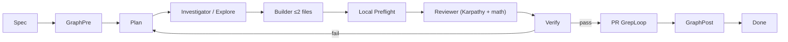

# Agentic engineering (hft3)

Summary of [Andrej Karpathy's agentic engineering](https://www.youtube.com/watch?v=LCEmiRjPEtQ) view, adapted for this repo: **spec-driven work**, **humans own architecture**, **agents implement and iterate**, **verification is mandatory** (tests and real gates—not narrative "done").

## Agentic engineering principles

| Principle | Meaning for hft3 |
|-----------|------------------|
| Spec-driven | Start from BLUEPRINT, production PDFs, and task specs—not ad-hoc prompts. |
| Human owns architecture | Boundaries (e.g. trial lane vs `data/npz/`, CHI404 gates) are human decisions; agents implement inside them. |
| Agents write code | Implementation, refactors, and docs drafts are delegated; orchestrator integrates. |
| Verify with tests | Every change loop ends in **pytest** and, for infra, **CHI404 PASS criteria**--not self-reported success. |
| Grep before review | Run a bounded, task-specific `rg` loop after every repo edit to catch stale terms, old API fields, missing citation rows, and fake status text before reviewer time. Codex self-review is not enough. |

## Karpathy four principles

Full detail: [AGENTS.md § Karpathy principles](../AGENTS.md#karpathy-principles). Apply alongside delegation on every task.

- **Think Before Coding** — State assumptions; ask when ambiguous.
- **Simplicity First** — Minimum code; no speculative abstractions.
- **Surgical Changes** — Touch only task scope; match existing style.
- **Goal-Driven Execution** — Verifiable success criteria; test-driven when possible.

## Mandatory subagent delegation

| Work type | Delegate to | Main thread keeps |
|-----------|-------------|-------------------|
| Find symbol / call graph / directory map | `cavecrew-investigator` (parallel OK) | Spec, which hits matter |
| Edit ≤2 files, obvious scope | `cavecrew-builder` | Paths, acceptance criteria |
| Post-edit dual-pass review (Karpathy + math) | `cavecrew-reviewer` per [REVIEWER_CHARTER.md](REVIEWER_CHARTER.md) | Merge decision |
| Wide unknown area | `explore` | Stop conditions |
| pytest, git, remote CHI404 | `shell` | Interpret failures, retry plan |
| 3+ files or new subsystem | Main or feature agent | Architecture, sequencing |

## Workflow



### Spec -> GraphPre -> Plan -> Code -> Local Preflight -> Review -> Verify -> PR GrepLoop -> GraphPost

1. **Spec** — Read relevant spec (BLUEPRINT, PDF prompts, issue). State invariants (data lanes, PASS gates).
2. **GraphPre** — `graphify query` or fresh `graphify-out/GRAPH_REPORT.md` before edits ([GRAPHIFY_WORKFLOW.md](GRAPHIFY_WORKFLOW.md)).
3. **Plan** — Orchestrator decomposes; spawn investigators in parallel if needed.
4. **Code** — Builder for surgical edits; main/feature agent for larger scope; shell for commands.
5. **Local preflight** — Run the mandatory local preflight loop in [docs/ai/GREPLOOP.md](ai/GREPLOOP.md): search changed scope for forbidden legacy terms, old fields, missing required terms/citation rows, and whitespace errors; patch actionable hits; max three local iterations.
6. **Review** — Dual-pass reviewer on diff. Both passes must be green before test commands can be used as merge evidence.
7. **Verify** — Run bounded `pytest`/build commands (and CHI404 validate when infra). No merge narrative without green commands.
8. **PR GrepLoop** — If a PR/MR/CL exists and an external PR AI review connector is installed, run the PR loop. Codex GitHub review is requested by `.github/workflows/codex_pr_review.yml` when enabled.
9. **GraphPost** — `graphify update .` or `scripts/graphify_rebuild.ps1` after code changes (AST-only, no Google API). Optional semantic PDF pass: `scripts/graphify_semantic_local.ps1` (local Ollama).

## Dual-pass review

Every code change requires **cavecrew-reviewer** under [REVIEWER_CHARTER.md](REVIEWER_CHARTER.md):

- **Pass A — Karpathy** — assumptions, simplicity, surgical edits, verifiable goals.
- **Pass B — Math invariants** — B1 filtration F_t, B2 event-time, B3 no lookahead, B4 walk-forward, B5 execution realism, B6 regime P(Z_t|F_t), B7 trial vs production lanes, B8 production failure states ([REVIEWER_CHARTER.md](REVIEWER_CHARTER.md) Pass B). Apply area-table columns only; full B1-B8 when in doubt.

Orchestrator spawns reviewer with the charter **Spawn prompt** block. Pass B findings must cite BLUEPRINT or full repo-root PDF section/page. Both passes must pass before pytest / CHI404 gates.

## hft3 verification commands

From repo root (local):

```bash
pytest
```

CHI404 tuning validation (on server after tuning logs exist):

```bash
python3 infrastructure/chi404/validate_pass_criteria.py \
  infrastructure/chi404/PASS_CRITERIA.json \
  /root/hft3/logs/tuning/<RUN_ID>
```

Full remote resume-from-step-4 orchestration (includes validate step):

```bash
bash scripts/run_chi404_validate_remote.sh
```

Orchestrator entry: `infrastructure/chi404/run_chi404_tuning.sh` (validate step calls `validate_pass_criteria.py`).

## Anti-patterns (grader / review)

| Anti-pattern | Why it fails |
|--------------|--------------|
| **Fake PASS gates** | Marking CHI404 or pipeline "PASS" without `validate_pass_criteria.py` / `PASS_FAIL.txt` on real log dirs. |
| **Fixture-only as done** | Rithmic trial passing on `fixture_connector` while live capture / Wine bridge untested. |
| **Tests skipped** | "Should pass" without `pytest` in the loop. |
| **Orchestrator implements everything** | Large inline edits burn context; use investigator → builder → reviewer → shell → graph post. |
| **Skipped subagent chain** | Main thread inline locate/edit/review with no subagent receipts; unacceptable on a live execution stack — see [AGENTS.md § Trust](../AGENTS.md#trust-non-skippable-workflow). |
| **Windows in HFT loop** | Wiring a dev workstation into live/paper Rithmic capture or order path — violates BLUEPRINT §4; colo must be self-sufficient. |
| **Dishonest merge-ready** | Claiming done while reviewer said no, tests skipped without documented blockers, or C++ parity gate not run. |
| **Skipped local preflight** | Letting stale field names, old vocabulary, or missing citation rows survive into reviewer/test cycles. |
| **Codex-only review** | Treating local agent self-review as equivalent to grep evidence, dual-pass reviewer, tests, or external PR AI review evidence. |
| **Oversized review surface** | Sending >1000 changed lines or unrelated subsystems through one review when the work can be split; external AI reviewers and humans need one coherent surface. |
| **Subset pytest as scope-green** | Targeted file pass while the scope test directory or gate script for the touched path fails. |
| **Verify todo theater** | Marking verify todos `completed` when pytest or gate scripts were waived, not run, or failed. |
| **Production mode without data** | Production YAML or paths with empty trusted lake — config-only, not "real-data wired". |
| **Synthetic-as-live probes** | Fixture, YAML, or CLI-default calibration labeled as live measurement or CHI404 PASS. |
| **Aspirational spec docs** | Math/spec doc implies end-to-end compliance without Implementation status / known gaps. |
| **Builder for 3+ files** | Builder refuses; wastes a turn—plan multi-file work in main/feature agent. |
| **Reviewer as architecture chat** | Use reviewer for diff findings; architecture stays with human + spec. |
| **Trial data in production lake** | Writing trial capture into trusted `data/npz/` (see `docs/rithmic_trial/README.md`). |

## Related docs

- [docs/VALIDATION_HONESTY.md](VALIDATION_HONESTY.md) — repo-wide status block, scope-green gates, forbidden verification theater
- [docs/ai/GREPLOOP.md](ai/GREPLOOP.md) — mandatory local `rg` loop plus external PR AI review loop when available
- [AGENTS.md](../AGENTS.md) — agent roles and repo conventions
- [GRAPHIFY_WORKFLOW.md](GRAPHIFY_WORKFLOW.md) — mandatory graph consult and rebuild
- [.cursor/rules/delegate-subagents.mdc](../.cursor/rules/delegate-subagents.mdc) — always-on delegation rule
- [.cursor/rules/graphify-mandatory.mdc](../.cursor/rules/graphify-mandatory.mdc) — graph before edit, rebuild after
- [.cursor/rules/karpathy-agentic.mdc](../.cursor/rules/karpathy-agentic.mdc) — Karpathy four principles (always-on)
