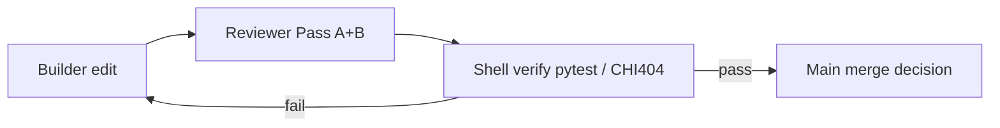

# Reviewer Charter

Mandatory contract for every code review in hft3. The orchestrator delegates diff audit to `cavecrew-reviewer` after builder edits; the reviewer runs **two fused passes** on every review. No merge narrative without a reviewer receipt and green verification (`pytest`, CHI404 gates when infra applies).

Related: [AGENTIC_ENGINEERING.md](AGENTIC_ENGINEERING.md), [AGENTS.md](../AGENTS.md), [BLUEPRINT.md](../BLUEPRINT.md).

## Authority and reference documents

When Pass B findings conflict with local convention, defer to these sources in order:

| Document | Repo path | Use when |
|----------|-----------|----------|
| Mathematical model | `chicago_cme_microstructure_mathematical_model.pdf` | Filtration, event-time, marked-point-process semantics |
| Developer handoff | `chicago_cme_microstructure_a_plus_developer_handoff.pdf` | Full system spec, validation standard, architecture |
| Production build | `chicago_cme_a_plus_production_implementation_prompt.pdf` | Live execution, failure states, gateway behavior |
| Trial pipeline | `rithmic_trial_hftbacktest_pipeline_prompt.pdf` | Quarantined trial lane, schema, replay wiring |
| Math disputes | `Ultimate_Quantitative_Finance_Researcher.pdf` | Probability, econometrics, microstructure arguments |
| Memory / concurrency / SIMD | `ultra_low_latency_hft_vector_search_architecture.pdf` | Zero-alloc hot path, cache alignment, lock-free IPC, MPHF/AVX design |
| Market-state hot memory | `chicago_futures_hot_memory_a_plus_developer_prompt.pdf` | HOT/WARM/COLD tiers, instrument registry, VIX/VVIX sensors, degradation |

Summary index: [BLUEPRINT.md](../BLUEPRINT.md). Memory index: [MEMORY_ARCHITECTURE.md](workbench/MEMORY_ARCHITECTURE.md) (dual authority — market-state: [HOT_MEMORY_UNIVERSE.md](workbench/HOT_MEMORY_UNIVERSE.md)).

---

## Pass A — Karpathy / agentic review

Apply on **every** diff regardless of area. Findings use severity rubric below.

### A1. Think before accepting

- Are assumptions stated (data lane, time range, connector mode, train vs eval split)?
- Ambiguity resolved in spec, not guessed in code?
- Tradeoffs surfaced when multiple valid implementations exist?

### A2. Simplicity

- Minimum code for the stated goal?
- No speculative abstractions, extra config surface, or features beyond the request?
- Would a senior engineer call this over-engineered?

### A3. Surgical changes

- Every changed line traces to the task?
- Orthogonal edits only (no drive-by refactors, renames, or comment churn)?
- Style matches surrounding code?

### A4. Goal-driven verification

- Success criteria verifiable (test, gate script, report artifact)?
- Tests added or updated when behavior changes?
- Fake PASS anti-patterns absent (fixture-only live claims, skipped `pytest`, CHI404 validate without real logs)?
- Subset pytest claimed as scope-green while scope directory or gate fails?
- Verify todos marked complete when waived or not run?
- Synthetic latency calibration labeled as live probe?

---

## Pass B — Mathematical logic review

Apply on every diff touching **features**, **backtest**, **decision_engine**, **data**, or **rithmic_trial** (see area table). Each invariant is non-negotiable unless the diff explicitly documents an approved spec exception.

### B1. Filtration integrity F_t

Features, labels, regime inputs, and decision logic at time `t` may use only information available at or before `t`. No global statistics, future bars, or full-session aggregates computed with knowledge after `t`.

**Reject if:** rolling windows include future rows; normalization uses test-set stats; join keys allow post-decision fields to leak backward.

### B2. Event-time correctness

MBO and microstructure logic operate on **marked asynchronous events** (add/cancel/modify/trade with exchange timestamps). Bar aggregation smuggled in as causal event-time is invalid unless explicitly labeled as a derived slow feature with its own lag audit.

**Reject if:** bar close used as decision timestamp without lag; replay order violates exchange sequence; trial depth treated as full MBO without fail-loud guard.

### B3. No lookahead / leakage

- No future labels in feature columns.
- Targets use forward returns only with explicit horizon and audit trail.
- No random train/test splits across calendar time.
- No test-set tuning without walk-forward discipline.

**Reject if:** shuffle split on time series; target column in feature matrix; hyperparameter search on holdout years.

### B4. Walk-forward discipline

Strict evaluation periods (from [BLUEPRINT.md](../BLUEPRINT.md) and `decision_engine/python/src/walk_forward.py`):

| Stage | Years |
|-------|-------|
| Discovery | 2018-2020 |
| Confirmation | 2021-2022 |
| Holdout | 2023-2024 |
| Recent holdout | 2025+ |
| Sim shadow | latest 60 CME days |

Models must pass stages in order. No holdout peeking for feature selection, threshold tuning, or kill/resurrect decisions.

**Reject if:** holdout metrics influence training; recent data used in discovery features; sim shadow skipped after historical PASS claim.

### B5. Execution realism

Edge evaluated **after** latency, queue position, fill probability, fees, and adverse selection. Backtests must use latency bands (0.5-10 ms), queue models (e.g. `LogProbQueueModel2`), and explicit cost calibration—not mid-price fantasy fills.

**Reject if:** zero-latency default without flag; gross PnL reported as net; trial UI-path latency passed off as colo hot-path.

### B6. Regime P(Z_t | F_t)

Regime is a **posterior** over latent states (`event_shock`, `liquidity_vacuum`, `stop_cascade`, etc.), not hardcoded calendar strings or hand-picked session labels without probabilistic update from `F_t`.

**Reject if:** `if hour == 9: regime = "open"` without posterior; regime feature uses future volatility to classify past bars.

### B7. Trial vs production data lanes

Trusted production research uses Databento GLBX.MDP3 MBO into `data/npz/`. Rithmic trial output stays quarantined:

- `data/raw/rithmic_trial_live_capture/`
- `data/normalized/rithmic_trial_live_capture/`
- `data/replay/hftbacktest/rithmic_trial/`

**Reject if:** trial capture, trial NPZ, or fixture data written into `data/npz/`; production backtest silently loads trial paths; config default blurs lanes.

See [docs/rithmic_trial/README.md](rithmic_trial/README.md).

### B8. Production failure states

Where live or gateway code applies, respect mathematical safety limits from production spec:

- stale market data halt
- disconnect halt
- clock drift halt
- position mismatch block
- daily loss limit flatten

**Reject if:** failure paths bypassed, swallowed, or mocked as always-healthy in production code paths without explicit sim-only guard.

---

## Severity rubric

| Label | Meaning | Action |
|-------|---------|--------|
| 🔴 | Breaks invariant or introduces leakage / lane violation | Block merge; must fix |
| 🟡 | Risks invariant; missing audit, ambiguous time semantics, unverified claim | Fix or document explicit spec waiver before merge |
| 🔵 | Style, naming, minor clarity; no invariant impact | Optional fix |

Output format (one line per finding):

```
path:line: <emoji> <severity>: <problem>. <fix>.
```

---

## Code areas — invariant applicability

| Code area | B1 | B2 | B3 | B4 | B5 | B6 | B7 | B8 |
|-----------|----|----|----|----|----|----|----|-----|
| `features_engine/` | x | x | x | | | x | | |
| `backtest_pipeline/` | x | x | x | x | x | | | |
| `decision_engine/` | x | | x | x | x | x | | x |
| `data_system/` (Databento, non-trial) | x | x | x | | | | x | |
| `data/`, `data/npz/` | | x | x | | | | x | |
| `data_system/rithmic_trial/` | x | x | | | x | | x | |
| `packages/crypto_lane/` | x | x | x | x | | | x | |
| `packages/equities_lane/` | x | x | x | x | | | x | |
| `workbench/` | x | x | x | x | x | | | |
| `options_lane/` | x | x | x | x | | | x | |
| `infrastructure/chi404/` | | | | | x | | | x |
| `rithmic_gateway/` | x | x | | | x | | | x |
| `infrastructure/` | | | | | x | | | x |
| `tests/` | scope | scope | scope | scope | scope | scope | scope | scope |
| `scripts/` | if touches data/features | if touches replay | if touches splits | if touches eval | if touches sim | if touches regime | if touches paths | if touches live |

Pass A applies to all rows. Pass B applies to marked columns for that area; when in doubt, run the full B1-B8 checklist.

---

## Spawn prompt (orchestrator → cavecrew-reviewer)

Paste the block below into a `cavecrew-reviewer` Task prompt. Replace `{diff scope}` with branch name, file list, or PR summary.

```markdown
Review diff scope: {diff scope}

Charter: docs/REVIEWER_CHARTER.md (mandatory).

Run fused Pass A + Pass B:

**Pass A (Karpathy / agentic)** — every finding:
- A1 Think: assumptions stated? ambiguity guessed?
- A2 Simplicity: over-engineering?
- A3 Surgical: orthogonal edits only?
- A4 Goal-driven: tests / verify criteria met? fake PASS? verify-run includes exit code + output tail?

If diff touches any research lane, workbench, CHI404 infra, or quarantined data path, apply [VALIDATION_HONESTY.md](VALIDATION_HONESTY.md); flag 🔴 if handoff claims merge-ready without scope-green, missing verify tail, or hides known addendum gaps.

**Pass B (mathematical invariants)** — apply area-table columns only for touched paths; when in doubt, full B1-B8:
- B1 Filtration F_t — only info up to decision time t
- B2 Event-time — MBO marked events; no bar-as-causal smuggling
- B3 No lookahead — no future labels; forward targets audited; no random time splits
- B4 Walk-forward — Discovery 2018-2020, Confirmation 2021-2022, Holdout 2023-2024, Recent 2025+, Sim shadow 60 CME days; no holdout peeking
- B5 Execution realism — latency 0.5-10ms, queue models, fees; net edge after costs
- B6 Regime P(Z_t|F_t) — no hardcoded regime strings without posterior
- B7 Data lanes — no trial data in data/npz production paths
- B8 Production failure states — stale halt, disconnect, clock drift, position mismatch, daily loss (where applicable)

Authority (docs/references/): chicago_cme_microstructure_mathematical_model.pdf, chicago_cme_microstructure_a_plus_developer_handoff.pdf, chicago_cme_a_plus_production_implementation_prompt.pdf, rithmic_trial_hftbacktest_pipeline_prompt.pdf, Ultimate_Quantitative_Finance_Researcher.pdf, ultra_low_latency_hft_vector_search_architecture.pdf. Summary index: BLUEPRINT.md. Memory index: workbench/MEMORY_ARCHITECTURE.md.

Output one line per finding:
path:line: <emoji> <severity>: [Pass A|Pass B] <problem>. <fix>.

Pass B findings must cite BLUEPRINT section or PDF name + section/page (full filenames above).

Severity: 🔴 breaks invariant | 🟡 risks invariant | 🔵 style

No praise. No scope creep suggestions. Receipt only.
```

---

## Reviewer workflow position



Reviewer audits the diff; reviewer does not replace `pytest` or `validate_pass_criteria.py`. Architecture disputes escalate to human + BLUEPRINT/PDFs, not reviewer redesign.
