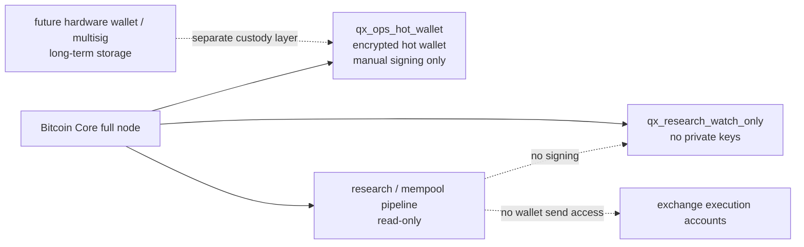

# Bitcoin Core Operational Wallet Setup - 2026-06-04

This record documents the small-balance Bitcoin Core operational wallet created
from the existing full node. This wallet is hot-wallet infrastructure only. It
is not cold storage and must not be used for meaningful long-term BTC custody.

## Node Health

- Host alias: `btc-node`
- Bitcoin Core: `v27.1.0`
- Chain: `main`
- Blocks / headers: `952280 / 952280`
- Initial block download: `false`
- Verification progress: `0.999990852`
- Network after restart: `networkactive=true`, `connections=35`, `in=25`, `out=10`
- Mempool after restart: `loaded=true`, `size=8319`

## RPC And Wallet Configuration

`bitcoin.conf` was sanitized to use `rpcauth` instead of plaintext
`rpcuser` / `rpcpassword`. RPC remains localhost-only.

```ini
server=1
rpcbind=127.0.0.1
rpcallowip=127.0.0.1
rpcauth=<redacted>
disablewallet=0
```

No RPC credentials, wallet passphrase, private keys, `.dat` wallet backups, or
runtime logs are stored in the repository.

## Wallets

### Hot Wallet

- Wallet name: `qx_ops_hot_wallet`
- Format: SQLite descriptor wallet
- Private keys enabled: `true`
- Avoid reuse: `true`
- Load on startup: `true`
- Locked by default: `unlocked_until=0`
- Intended use: controlled small BTC operational tests only

First receiving address:

```text
bc1q4cxt4wpxy0wgcan68ry7pfa98wg0y4mdcychxl
```

### Research Watch-Only Wallet

- Wallet name: `qx_research_watch_only`
- Private keys enabled: `false`
- Descriptor wallet: `true`
- Imported address: `bc1q4cxt4wpxy0wgcan68ry7pfa98wg0y4mdcychxl`
- Intended use: analytics, UTXO visibility, balances, and reporting only

## Backups

Remote node backup location:

```text
/secure/offline_backups/
```

Temporary MSI Desktop copy for offline-media transfer:

```text
C:\Users\MSI\Desktop\qx_wallet_setup
```

Hot wallet backup:

```text
/secure/offline_backups/qx_ops_hot_wallet_20260604.dat
SHA256: 9a60bfbf76707615f60c86542597210f9a499636f985d5d0831665f76a2cd274
```

Watch-only wallet backup:

```text
/secure/offline_backups/qx_research_watch_only_20260604.dat
SHA256: ec20c1c8c25e52c9d79c0ff9960cdee45bab9c87aa79f6c50715c7dcff55a238
```

The Desktop copies were hash-verified against the remote `.sha256` files. Move
the hot wallet backup to at least two offline media locations before funding
beyond dust or test amounts. Remove the local passphrase transfer file after the
offline copies are complete.

## Restore Test

Restore test passed before funding:

- Restored `qx_ops_hot_wallet_20260604.dat` into a separate temporary Bitcoin
  Core datadir.
- Started the restore instance with networking disabled.
- Loaded restored wallet as `qx_ops_hot_wallet_restore_test`.
- Confirmed the restored wallet recognized the first receiving address.
- Confirmed restored wallet remained locked with `unlocked_until=0`.

Restore procedure:

```powershell
bitcoin-cli restorewallet "qx_ops_hot_wallet_restore_test" "<backup_file>" false
bitcoin-cli -rpcwallet=qx_ops_hot_wallet_restore_test getwalletinfo
bitcoin-cli -rpcwallet=qx_ops_hot_wallet_restore_test getaddressinfo "<receiving_address>"
```

## Signing Policy

The hot wallet stays locked by default. Future signing or send operations require
manual approval and a short unlock window:

```powershell
bitcoin-cli -rpcwallet=qx_ops_hot_wallet walletpassphrase "<PASSPHRASE>" 60
# perform exactly one approved send/sign action
bitcoin-cli -rpcwallet=qx_ops_hot_wallet walletlock
```

No strategy engine, mempool collector, backtest engine, Streamlit surface, or
agent process may call:

```text
walletpassphrase
send
sendtoaddress
sendmany
sendall
signrawtransactionwithwallet
walletprocesspsbt
```

Any automated wallet-facing service must be read-only unless explicitly
approved.

## Separation Diagram



## Hard Rule

This node wallet is operational hot-wallet infrastructure only. Long-term BTC
storage belongs in a later hardware-wallet or multisig custody design.
