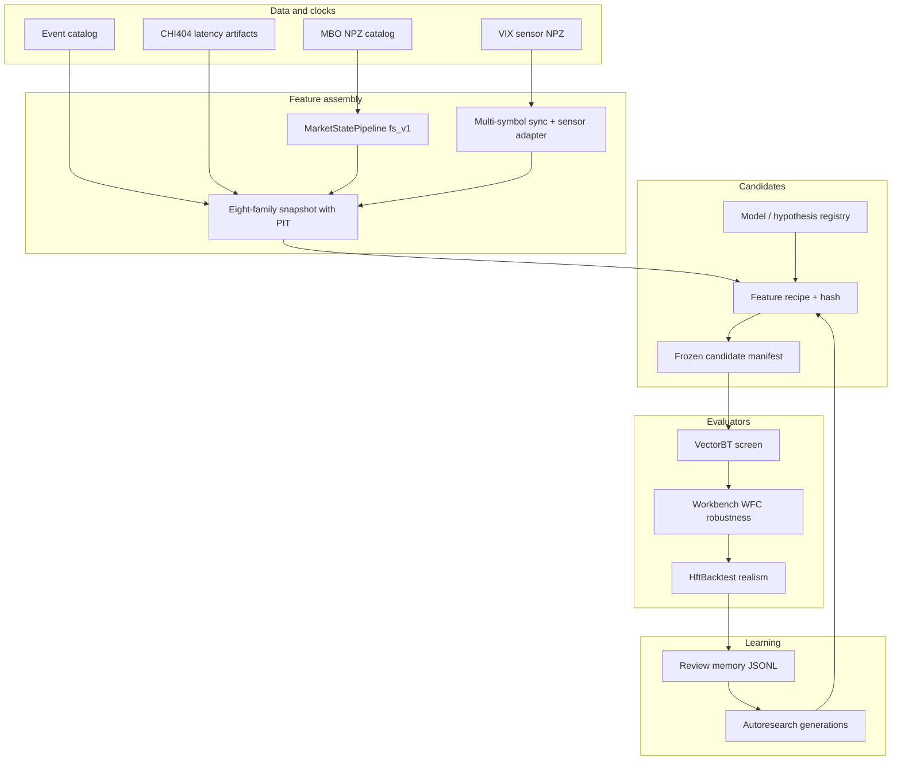

# Feature-Family Implementation Audit

**Date:** 2026-06-18  
**Authority prompt:** [FEATURE_FAMILY_RESEARCH_SYSTEM_PROMPT.md](FEATURE_FAMILY_RESEARCH_SYSTEM_PROMPT.md)  
**Phase:** 0 (audit only — no research code changes in this deliverable)

## Canonical feature families (do not rename)

```yaml
feature_families:
  - primary_fs_v1
  - cross_asset_futures
  - vix_vvix_sensor
  - vix_options
  - cme_options_context
  - macro_context
  - continuous_session
  - latency_state
```

Contract owner: `packages/backtest_pipeline/src/feature_plane.py` (`FEATURE_FAMILIES`, consumption vocabulary).

---

## Per-capability inventory

| Capability | Canonical authority | Primary code path | Configuration | Tests | Artifacts | Status | Missing connection | Duplicate / obsolete | Minimal required change |
|------------|---------------------|-------------------|---------------|-------|-----------|--------|--------------------|--------------------|-------------------------|
| Primary MBO extraction | `specs/FEATURES.md`, `docs/research/MBO_FEATURE_PACKET_SOURCE_OF_TRUTH.md` | `packages/features_engine/src/features/mbo_features.py`, `feature_index.py`, C++ `feature_extractor.cpp` | `HFT3_FEATURE_BACKEND` | `tests/test_cpp_feature_golden.py`, `tests/test_feature_parity.py`, `tests/test_market_state_pipeline_features.py` | `FEATURE_VERSION=fs_v1` in feature store | **implemented** | C++ parity gate on slot changes | Python vs C++ dual path | Keep both; gate merges on golden |
| Market-state assembly | `specs/FEATURES.md` | `packages/features_engine/src/pipeline/market_state_pipeline.py` | `tick_size`, `latency_ms` | `tests/test_market_state_pipeline_features.py`, `tests/test_regime_pipeline.py` | `MarketState` in replay/HBT | **implemented** | — | `combined_strategy_integration.py` parallel integrator | Document single assembly owner |
| Feature slot definitions (64-dim) | `specs/FEATURES.md` | `packages/features_engine/src/features/feature_index.py` | Slot table in spec | `tests/test_cpp_feature_golden.py`, prop slot tests | Registry YAML | **implemented** | PDF slots 50–63 separate from HYP index | PDF structural models registry | No merge without C++ review |
| Cross-asset hypotheses | `specs/FEATURES.md` § cross-asset | `packages/features_engine/src/hypotheses/modules.py`, `registry.py` | `HFT3_CROSS_ASSET=0` ablation | `tests/test_cross_asset_replay.py` | `runtime/audits/hfc3_acceptance_status.md` | **partial** | Leader-symbol MBO not wired to VBT screen; placeholder OFI | `hfc3/replay/multi_asset_replay.py` vs `replay_session.py` | Wire real leader NPZ; fail closed on missing leg |
| VIX/VVIX features | `docs/cockpit/MACRO_CONTEXT_VIX_OPTIONS_CHECKLIST.md` | `packages/features_engine/src/features/vix_features.py` | `vix_extra_latency_ms` | `tests/test_features/test_vix_hypotheses.py` | VIX sensor NPZ → replay adapter | **partial** | Not consumed in VectorBT bar stub | — | Inject via `sensor_feature_adapter` into screening path |
| Sensor replay injection | Same checklist | `packages/replay/sensor_feature_adapter.py`, `replay_session.py` | Sensor NPZ paths on replay | `tests/test_cross_asset_replay.py` | Precomputed feature rows | **implemented** | Not connected to VectorBT paid runner | — | Reuse adapter in fs_v1 row loop |
| Multi-symbol synchronization | `specs/FEATURES.md` PIT rules | `packages/replay/market_data_adapter.py`, `replay_session.py:326+` | Replay config | `tests/test_cross_asset_replay.py`, `tests/test_replay_feature_latency.py` | Sync timestamps per symbol | **partial** | HFC3 tensor path offline-only | `hfc3/replay/multi_asset_replay.py` | One sync mechanism: `sync_to_timestamp` |
| Macro-event context | `docs/vault/ECONOMIC_EVENT_UNIVERSE.md`, `OPPORTUNITY_RESEARCH_SPEC.md` | `apps/workbench/src/data/event_catalog.py`, `events.csv`, `model_event_binding.yaml` | Event catalog YAML/CSV | `tests/test_workbench/test_event_catalog.py` | Q001 catalog status | **partial** | Context uplift not in VBT; target-only vs target+context not split in screen | — | Ablation fields on screening artifact |
| Continuous/session features | `OPPORTUNITY_RESEARCH_SPEC.md` | `market_state_pipeline.py` session helpers | Walk-forward periods | `tests/backtest_pipeline/test_feature_plane.py` | Family row `continuous_session` | **partial** | Scheduled-event screen marks out of scope | — | Enable when `research_clock=continuous_intraday` |
| Latency features | `docs/vault/HFTBACKTEST_LATENCY_ONTOLOGY.md`, `docs/workbench/LATENCY_ARCHITECTURE.md` | `MarketState.latency_ms`, `replay_session.py`, `latency_components.py` | CHI404 latency JSON | `tests/test_replay_feature_latency.py` | `latency_feature_status` on artifacts | **partial** | Family exists in contract; not model feature in VBT | Order latency (HBT) vs feature clock | Typed `latency_state` family with artifact IDs |
| Feature-plane contract | `docs/project/VECTORBT_SCREENING_ENGINE_SPEC.md` | `packages/backtest_pipeline/src/feature_plane.py` | Eight-family manifest | `tests/backtest_pipeline/test_feature_plane.py` | `feature_usage_manifest` on every screen | **implemented** | Families default `not_used` in bar stub | Mirrors `hft_campaign/ontology.py` | Wire consumption proofs per family |
| Candidate / model registry | `docs/structural_models/PDF_MODELS.md`, `docs/workbench/MODEL_CATALOG.md` | `model_registry.py`, `hypotheses/registry.py`, `structural_models/registry.py` | `model_registry.yaml`, `models.yaml` | Registry slug tests | 44 HYP + 7 PDF inventory | **implemented** | No feature-recipe object yet | Three registries (HYP/PDF/slug) | Extend candidate packet, new registry |
| VectorBT screening | `VECTORBT_SCREENING_ENGINE_SPEC.md`, `VBT_MODEL_ONTOLOGY.md` | `packages/backtest_pipeline/src/vectorbt_adapter.py` | `DEFAULT_PARAM_GRID`, `bar_construction_id` | `tests/test_vectorbt_adapter.py` | `screening_artifact.json` | **partial** | Default OHLCV bar stub; 4-param grid only | Stage A `stage_a_screen.py` fs_v1 path | Feature-recipe frozen manifest before screen |
| Robustness gates | `ROBUSTNESS_TESTING_SPEC.md` | `robustness_bridge.py`, `workbench/.../campaign_runner.py` | `wfc_gate.yaml`, `walk_forward.yaml` | `tests/backtest_pipeline/test_robustness_bridge.py` | WFC summary under campaign dir | **implemented** | Caller must supply screened params (`frozen_strategy_params`) | `research_pipeline/robustness_producers.py` | Autoresearch already wires top-K |
| HftBacktest realism | `HFTBACKTEST_REALISM_ENGINE_SPEC.md`, `HFTBACKTEST_CAMPAIGN_ARCHITECTURE.md` | `hft_campaign/runner.py`, `hftbacktest_realism.py` | `HftCampaignConfig` | `tests/backtest_pipeline/hft_campaign/` | Campaign manifests, HBT-0..4 | **implemented** | Default `scheduled_event_only`; no recipe-hash equality gate | Legacy `run_event_replay.py` | Add VBT↔HBT `feature_recipe_hash` gate |
| Autonomous research memory | `AUTORESEARCH_GAP_MATRIX.md` (superseded rows below) | `generation_loop.py`, `review_memory.py`, `run_pipeline.py --autoresearch` | `config/autoresearch/default.yaml` | `tests/research_pipeline/test_generation_loop.py` | `research_cards/autoresearch/` | **partial** | Refines 4 execution params, not feature recipes | Idea packet memory vs autoresearch JSONL | Phase 7: family-aware candidate generation |
| Paid VectorBT runner | `VBT_PAID_SCREEN_RUNBOOK.md` | `scripts/run_vectorbt_paid_screen.py`, `run_pipeline.py --vectorbt-scope paid-compute` | Worker count, rust engine | `tests/test_vectorbt_paid_screen_gate.py` | Paid unit JSONL → screening artifacts | **partial** | Same bar-stub data plane | Stage A vs paid JSONL | Block paid until pilot proves families |

---

## Canonical versus obsolete paths

| Entry point / path | Classification | Owner doc | Notes |
|--------------------|----------------|-----------|-------|
| `scripts/run_pipeline.py --vectorbt` | **canonical** | `RESEARCH_ENTRYPOINTS.md` | Primary screen CLI |
| `scripts/run_pipeline.py --autoresearch` | **canonical** (limited) | `AUTORESEARCH_GAP_MATRIX.md` | Multi-gen loop; execution-param refinement until Phase 7 |
| `scripts/run_pipeline.py --hftbacktest-realism` | **canonical** | `HFTBACKTEST_REALISM_ENGINE_SPEC.md` | Single-shot HBT handoff |
| `scripts/hft_run_campaign.py` / `hft_campaign/runner.py` | **canonical** | `HFTBACKTEST_CAMPAIGN_ARCHITECTURE.md` | Batch HBT scenarios |
| `workbench/src/run/campaign_runner.run_campaign` | **canonical** | Workbench README | WFC robustness |
| `scripts/run_vectorbt_paid_screen.py` | **canonical** (gated) | `VBT_PAID_SCREEN_RUNBOOK.md` | Paid compute blocked until pilot |
| `vectorbt_adapter` default OHLCV bar path | **diagnostic-only** | `feature_plane.py` | Emits `bar_stub_research_only` |
| `packages/backtest_pipeline/src/stage_a_screen.py` | **supported but limited** | Stage A docs | Full fs_v1 row loop; not default VBT path |
| `scripts/run_event_replay.py` | **retired** | `RESEARCH_ENTRYPOINTS.md` §1a | Historical; fail-closed for new research |
| `scripts/run_event_universe.py` | **retired** | Cockpit M6 plan | Replaced by VectorBT/HBT path |
| `packages/backtest_pipeline/src/replay_matrix.py` | **retired** | HBT realism spec | Do not wire new work |
| `ReplaySession` macro replay discovery | **retired** | `RESEARCH_ENTRYPOINTS.md` | Certification artifacts only |
| `packages/hfc3/replay/multi_asset_replay.py` | **diagnostic-only** | HFC3 audits | Offline tensor; not production feed |
| `DEFAULT_PARAM_GRID` (4 strategy params) | **supported but limited** | `vectorbt_adapter.py:268` | Execution refinement pilot; **not** feature-family search |
| `model_generation.expand_for_vectorbt` grid | **supported but limited** | `research_pipeline/model_generation.py` | Same — label in autoresearch config |
| `packages/hft3/research/run_autonomous.py` | **blocked** | Out of scope | Do not extend |

**Rule:** A retired path must fail closed, carry a CLI/doc warning, or be labeled diagnostic-only. Two paths must not appear equally authoritative.

---

## Known fail-closed / placeholder behaviors (Phase 0 findings)

| Issue | Location | Required fix (later phase) |
|-------|----------|----------------------------|
| Own-symbol OFI as cross-asset leader | `specs/FEATURES.md:157`, `structural_models/model_02_cross_asset_lead_lag.py` | Real leader MBO or sideline |
| Bar stub labeled as full product | `feature_plane.py` classifier | Already refuses `feature_complete_pit_declared` |
| Missing VIX → zero fill | `vix_features.py` (audit: no silent zero) | Tests enforce; wire to VBT |
| 4-param grid as “self-learning” | `elite_refinement.py`, `DEFAULT_PARAM_GRID` | Phase 7 family recipes |
| Latency as CLI-only | HBT runner configs | Phase 4 `latency_state` family |
| Macro context conflated | Opportunity spec | Separate target-only vs uplift artifacts |

---

## Feature-family status manifest (Phase 0 snapshot)

Machine-readable copy: [FEATURE_FAMILY_STATUS_MANIFEST.yaml](FEATURE_FAMILY_STATUS_MANIFEST.yaml)

| Family | Source gen | Sync | VBT consumption | HBT consumption | Autonomous gen | PIT proof | Ablation | Data coverage | Blocker |
|--------|------------|------|-----------------|-----------------|----------------|-----------|----------|---------------|---------|
| primary_fs_v1 | implemented | implemented | not_used (bar stub) | partial | eligible (stub) | partial | not_measured | NPZ catalog | fs_v1 row loop not default in VBT |
| cross_asset_futures | partial | partial | not_used | not_measured | blocked | missing | missing | multi-symbol NPZ gaps | placeholder OFI |
| vix_vvix_sensor | implemented | implemented | not_used | not_measured | blocked | partial | missing | sensor NPZ | VBT wiring |
| vix_options | partial | partial | not_used | not_measured | blocked | partial | missing | depth/strike gaps | options data |
| cme_options_context | partial | not_measured | not_used | not_measured | blocked | missing | missing | options lane quarantine | data + wiring |
| macro_context | implemented (catalog) | implemented | not_used | not_measured | blocked | partial | not_measured | event catalog | uplift ablation path |
| continuous_session | implemented | implemented | sidelined_scope | not_measured | blocked | partial | not_measured | scheduled vs intraday clock | scope declaration |
| latency_state | partial | partial | not_used | partial (exec) | blocked | partial | missing | CHI404 artifacts | model feature family |

---

## Dependency diagram (feature families → evaluators)



---

## Data-clock diagram

```text
target_decision_ts
  − feature_transport_latency
  = latest_admissible_source_ts

For each family source row:
  use max(source_ts) where source_ts <= latest_admissible_source_ts

Families carry:
  family_id, source_ids, source_ts, feature_availability_ts,
  target_decision_ts, units, feature_version,
  missingness, staleness, PIT proof, consumption state
```

Reference implementation: `packages/replay/sensor_feature_adapter.py` (latest row ≤ target).

---

## Phase 0 completion checklist

- [x] Capability inventory (17 areas)
- [x] Canonical vs obsolete path table
- [x] Feature-family status manifest
- [x] Dependency and clock diagrams
- [x] Minimal change column per capability
- [ ] Phase 1+ code (explicitly deferred)

**Next step:** [RESEARCH_SYSTEM_EXECUTION_ORDER.md](../human/RESEARCH_SYSTEM_EXECUTION_ORDER.md) — read and execute in order. Phase 1 begins with typed family metadata and recipe hashing on the existing candidate object.
