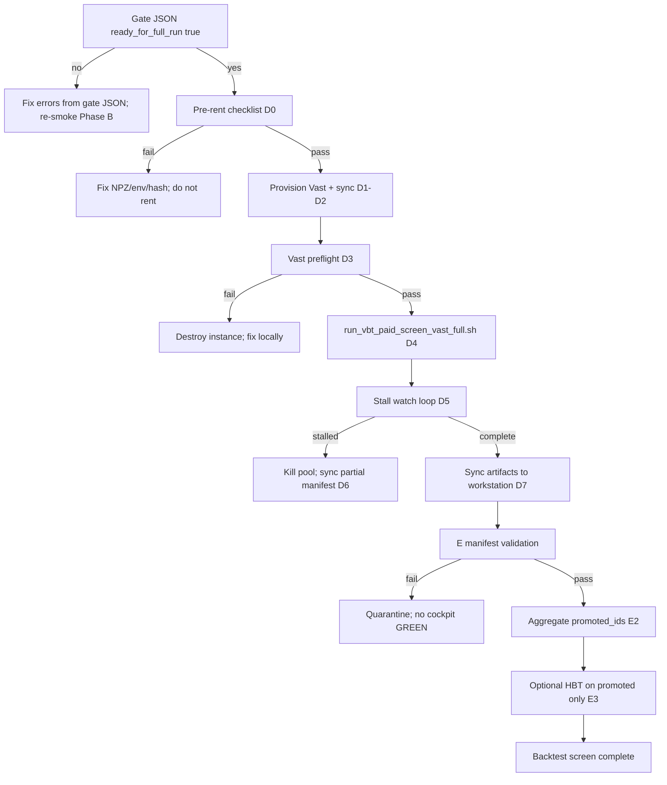

# VectorBT paid screen — post-gate execution playbook

Status: **authoritative sequence after Phase B smoke passes** (zero unit errors, lookahead proof present).
Companion: [VBT_PAID_SCREEN_RUNBOOK.md](VBT_PAID_SCREEN_RUNBOOK.md) (Phases A–E overview).

**Rule:** Do not rent Vast 256 vCPU until `runtime/reports/paid_screen_ready_gate.json` has `ready_for_full_run: true`. Smoke pass alone is not enough — Phase C must write the gate file with exit code 0.

```bash
python scripts/vbt_paid_screen_next_steps.py
```

That script reads pilot / smoke / gate / full manifests and prints the **exact next command block** for the current phase.

---

## Decision tree (no ambiguity)



---

## Phase C completion record (required before rent)

After smoke, run the gate **on the workstation** (not on Vast):

```bash
export HFT3_REPO="$(pwd)"
export VBT_PILOT_ARTIFACT="<path>/screening_artifact.json"
export VBT_SMOKE_MANIFEST="<path>/paid_screen_run_manifest.json"

python scripts/validate_paid_screen_ready_gate.py \
  --pilot-artifact "$VBT_PILOT_ARTIFACT" \
  --smoke-manifest "$VBT_SMOKE_MANIFEST" \
  --out runtime/reports/paid_screen_ready_gate.json
```

**Proceed only if:**

| Field / check | Requirement |
|---------------|-------------|
| Exit code | `0` |
| `ready_for_full_run` | `true` |
| `errors` | empty array |
| `lookahead_pytest_tail` | pytest exit 0 (do not use `--skip-pytest` for production gate) |
| `smoke_manifest_summary.failed_work_units` | `0` |
| `pilot_hashes.events_csv_hash` | equals smoke unit hash |
| `pilot_hashes.lake_manifest_hash` | equals smoke unit hash |

Archive the gate JSON in the run folder:

```bash
cp runtime/reports/paid_screen_ready_gate.json \
  "research_cards/pipeline_runs/$(basename "$(dirname "$VBT_SMOKE_MANIFEST")")/paid_screen_ready_gate.json"
```

---

## Phase D0 — Pre-rent checklist (workstation, $0)

Complete **every row** before creating a Vast instance. Unit generation happens **on Vast** (D4 via `run_vbt_paid_screen_vast_full.sh`), not from local Stage A survivors.

| # | Check | Command / action | Pass criterion |
|---|--------|------------------|----------------|
| 1 | Gate file | `jq .ready_for_full_run runtime/reports/paid_screen_ready_gate.json` | `true` |
| 2 | Git head | `git rev-parse HEAD` | Same commit synced to Vast |
| 3 | NPZ lake | `test -n "$HFT3_NPZ_ROOT" && test -f "$HFT3_MANIFEST_PATH"` | Paths exist on Vast target |
| 4 | Lake hash | Match gate `pilot_hashes.lake_manifest_hash` | Exact string match |
| 5 | Events hash | Match gate `pilot_hashes.events_csv_hash` | Exact string match |
| 6 | Rust VectorBT | `python -c "import vectorbt; print(vectorbt.__version__)"` on Vast after install | `vectorbt[rust]==1.0.0` |
| 7 | Unit scope | Review [VBT_PAID_SCREEN_UNIT_SCOPE.md](VBT_PAID_SCREEN_UNIT_SCOPE.md) | `events.csv` TIGHT × active models × M6 symbols |
| 8 | ETA | `units_per_hour` from smoke × estimated unit count | Owner accepts wall clock + cost |
| 9 | Stall policy | Document `stall_minutes: 30` in declaration | Written before rent |
| 10 | Abort policy | `abort_on_failed_units: true` | Any ERROR → kill pool, no cockpit GREEN |

Declaration template (write on Vast **after** on-host unit generation in D4, or pre-fill `expected_work_units` from a dry-run on Vast):

```bash
python - <<'PY'
import json, subprocess
from pathlib import Path
gate = json.loads(Path("runtime/reports/paid_screen_ready_gate.json").read_text())
units_path = Path("runtime/reports/vbt_full_units.jsonl")
units = sum(1 for _ in units_path.open() if _.strip()) if units_path.is_file() else None
decl = {
    "host_vcpu": 256,
    "reserved_vcpu": 26,
    "workers_requested": 230,
    "expected_work_units": units,
    "units_source": "events.csv TIGHT × CME M6 symbols × active model registry (generated on Vast host)",
    "stall_minutes": 30,
    "abort_on_failed_units": True,
    "git_head": subprocess.check_output(["git", "rev-parse", "HEAD"], text=True).strip(),
    "events_csv_hash": gate["pilot_hashes"]["events_csv_hash"],
    "lake_manifest_hash": gate["pilot_hashes"]["lake_manifest_hash"],
    "smoke_units_per_hour": gate["smoke_manifest_summary"]["units_per_hour"],
}
Path("runtime/reports/vbt_full_run_declaration.json").write_text(json.dumps(decl, indent=2) + "\n")
print(json.dumps(decl, indent=2))
PY
```

**Do not rent** if any checklist row fails.

---

## Phase D1 — Vast host setup

1. **Instance:** 256 vCPU bare-metal or closest Vast offer; **≥500 GB** disk for NPZ lake + artifacts.
2. **Sync repo** (same `git_head` as declaration):

```bash
git clone <repo-url> hft3 && cd hft3
git checkout <git_head from declaration>
git submodule update --init vendor/openfoundry vendor/alphageometry
export PYTHON=python3
bash scripts/install_vbt_hbt_handoff_verify_deps.sh
```

3. **Sync NPZ lake** — same manifest as pilot/smoke (`HFT3_MANIFEST_PATH`). Verify hash:

```bash
export HFT3_NPZ_ROOT=/data/npz
export HFT3_MANIFEST_PATH=/data/npz/manifest.parquet
# hash must match declaration lake_manifest_hash
```

4. **Copy gate file** from workstation:

```bash
scp runtime/reports/paid_screen_ready_gate.json vast:/path/hft3/runtime/reports/
```

---

## Phase D2 — On-host unit manifest (Vast, before workers)

**Source of truth:** `packages/data_system/config/events.csv` + active hypothesis registry (`--all-active-models`). Stage A survivors are **not** required; historical `--from-stage-a-survivors` remains for M6 backward compatibility only.

```bash
python scripts/generate_vbt_paid_units_jsonl.py \
  --all-active-models \
  --events-csv packages/data_system/config/events.csv \
  --symbols MES.v.0,MNQ.v.0,ES.v.0,NQ.v.0,ZN.v.0,ZB.v.0,RTY.v.0 \
  --out runtime/reports/vbt_full_units.jsonl

# Sanity
python scripts/run_paid_screen.py \
  --units-jsonl runtime/reports/vbt_full_units.jsonl \
  --out /tmp/vbt_dry_run \
  --dry-run
```

Record `expected_work_units` from `wc -l runtime/reports/vbt_full_units.jsonl` and dry-run line `DRY_RUN units=N`. `run_vbt_paid_screen_vast_full.sh` performs this step automatically.

---

## Phase D3 — Vast preflight (before 230 workers)

```bash
cd "$HFT3_REPO"
export HFT3_NPZ_ROOT=...
export HFT3_MANIFEST_PATH=...

# Bounded verify (must pass)
bash scripts/run_vbt_hbt_handoff_verify.sh

# Gate file still valid
jq .ready_for_full_run runtime/reports/paid_screen_ready_gate.json

# Dry-run full unit count
python scripts/run_paid_screen.py \
  --units-jsonl runtime/reports/vbt_full_units.jsonl \
  --out /tmp/preflight_out \
  --dry-run

# Dry-run full unit count after units are generated
python scripts/run_paid_screen.py \
  --units-jsonl runtime/reports/vbt_full_units.jsonl \
  --out /tmp/vbt_full_dryrun \
  --vectorbt-scope paid-compute \
  --workers 230 \
  --max-units-per-batch 2 \
  --dry-run
```

Record `N_FULL` from `wc -l runtime/reports/vbt_full_units.jsonl` and dry-run `DRY_RUN units=N`.

### Phase D3.5 — Paid-compute sample before scale

Run one real paid-compute unit through the same v2 wrapper before any 230-worker full launch:

```bash
cd "$HFT3_REPO"
set -a; source /root/hft3/.env; set +a
export PYTHON=python3
export HFT3_NPZ_ROOT=/data/npz
export HFT3_MANIFEST_PATH=/data/npz/manifest.parquet

export VBT_SAMPLE_MODE=1
export VBT_FULL_RUN_ID="paid_sample_1u_$(date -u +%Y%m%dT%H%M%SZ)"
export VBT_FULL_UNITS_JSONL=runtime/reports/vbt_sample_1u.jsonl
export VBT_WORKERS=1
export VBT_MAX_UNITS=1
export VBT_MAX_UNITS_PER_BATCH=1
export VBT_BATCH_TIMEOUT_SECONDS=1200
export VBT_MAX_WALL_CLOCK_SECONDS=1800
export VBT_MODEL_SCOPE=single
export VBT_MODEL_ID=SPREAD_BLOWOUT_RECOMPRESSION
export VBT_SYMBOLS=MES.v.0
export VBT_EVENT_TYPES=CPI
export VBT_START_DATE=2024-09-11
export VBT_END_DATE=2024-09-11

SECONDS=0
bash scripts/run_vbt_paid_screen_vast_full.sh
echo "elapsed_seconds=$SECONDS"
jq '{status, expected_work_units, completed_work_units, failed_work_units, units_per_hour}' \
  research_cards/pipeline_runs/${VBT_FULL_RUN_ID}/paid_screen_run_manifest.json
```

Sample pass: manifest `status=complete`, `completed_work_units=1`, `failed_work_units=0`, screening artifact exists, `vectorbt_engine=rust`, and lookahead proof fields are present.

Cost estimate before scale:

```text
sample_uph_per_worker = sample_completed / sample_elapsed_hours
full_wall_hours = N_FULL / (sample_uph_per_worker * workers * efficiency)
full_cost_usd = full_wall_hours * vast_price_usd_per_hour
batch_safe = floor((batch_timeout_seconds * 0.8) / sample_unit_p95_seconds)
```

Use efficiency `0.5` to `0.8` until a 16-worker or 32-worker mini-run proves better. If one unit takes about 480 seconds, a 50-unit batch takes about 24,000 seconds and cannot fit a 1,800-second timeout. Start with `VBT_MAX_UNITS_PER_BATCH=1` for the sample and `2` for scale unless the sample p95 supports a higher cap.

**Only after sample pass and owner acceptance of estimated wall-clock/cost:** start tmux full run (D4).

---

## Phase D4 — Full paid run (tmux, **v2 orchestrator**, workers from declaration or `VBT_WORKERS`)

**Scope:** [VBT_PAID_SCREEN_UNIT_SCOPE.md](VBT_PAID_SCREEN_UNIT_SCOPE.md) — `events.csv` TIGHT × active models × CME M6 symbols; not CPI+NFP smoke.

**Preferred on Vast (generates units + runs v2 orchestrator):**

```bash
bash scripts/run_vbt_paid_screen_vast_full.sh
```

Uses `scripts/run_paid_screen.py` (v2 long-lived workers).
Resume: `export VBT_RESUME=1`. Cache/recycle knobs: `VBT_CACHE_MEMORY_LIMIT_MB`,
`VBT_CACHE_MAX_ENTRIES`, `VBT_MAX_BATCHES_BEFORE_RECYCLE`. See
[PAID_SCREEN_OPS_COMMANDS.md](PAID_SCREEN_OPS_COMMANDS.md).

From workstation via SSH:

```bash
# Preferred: separate host and port (non-22 ports require this)
export VAST_SSH_HOST='root@<vast-host>'
export VAST_SSH_PORT='<port>'
bash scripts/vast_ssh_run_vbt_paid_screen.sh

# Or ssh-config alias / host-only (port from ~/.ssh/config when applicable)
export VAST_SSH_TARGET='<vast-ssh-alias-or-user@host>'
bash scripts/vast_ssh_run_vbt_paid_screen.sh
```

Do **not** embed `-p <port>` inside `VAST_SSH_TARGET`; the wrapper passes host and port as separate `ssh`/`scp` arguments.

Manual equivalent (after D2 unit generation):

```bash
tmux new -s vbt_full
export HFT3_REPO="$(pwd)"
export VBT_FULL_RUN_ID="paid_full_$(date -u +%Y%m%dT%H%M%SZ)"

python scripts/run_paid_screen.py \
  --units-jsonl runtime/reports/vbt_full_units.jsonl \
  --out "research_cards/pipeline_runs/${VBT_FULL_RUN_ID}" \
  --vectorbt-scope paid-compute \
  --workers "${VBT_WORKERS:-230}" \
  --ready-gate-file runtime/reports/paid_screen_ready_gate.json \
  --max-wall-clock-seconds 86400 \
  --max-batches-before-recycle 100 \
  --max-units-per-batch 2 \
  --batch-timeout-seconds 1800 \
  --cache-memory-limit-mb 4096 \
  --cache-max-entries 1000 \
  --no-llm \
  2>&1 | tee "research_cards/pipeline_runs/${VBT_FULL_RUN_ID}/orchestrator.log"
```

Orchestrator **refuses** `--workers > 16` without valid `--ready-gate-file`.

Per-unit artifacts land at:

`research_cards/pipeline_runs/${VBT_FULL_RUN_ID}/units/<unit_id>/screening_artifact.json`

Terminal manifest:

`research_cards/pipeline_runs/${VBT_FULL_RUN_ID}/paid_screen_run_manifest.json`

---

## Phase D5 — Stall monitor (parallel shell)

Every 5 minutes while D4 runs:

```bash
python scripts/validate_paid_screen_ready_gate.py \
  --watch-manifest "research_cards/pipeline_runs/${VBT_FULL_RUN_ID}/paid_screen_run_manifest.json" \
  --stall-minutes 30
```

Also watch:

```bash
jq '{completed,failed,skipped,expected: .expected_work_units, u_ph: .units_per_hour}' \
  "research_cards/pipeline_runs/${VBT_FULL_RUN_ID}/paid_screen_run_manifest.json"
```

| Signal | Action |
|--------|--------|
| `failed_work_units > 0` and `abort_on_failed_units` | Kill tmux session; preserve manifest; **do not** cockpit-import |
| No `completed` delta for 30+ min, CPU idle | Capture `ps aux`, `iostat`, orchestrator.log tail; kill pool |
| `units_per_hour` &lt; 50% smoke rate | Investigate I/O; do not blindly add workers |
| Manifest `status=complete` | Proceed to D7 |

---

## Phase D6 — Abort / partial recovery

1. Kill worker pool (`tmux kill-session -t vbt_full` or `pkill` orchestrator children only).
2. Ensure `paid_screen_run_manifest.json` exists (orchestrator writes on exit).
3. `rsync` manifest + `units/` to workstation **before** destroying Vast instance.
4. Mark run `partial` in cockpit notes — **never** GREEN.
5. Fix root cause; re-run **smoke** if code/env changed; re-gate; new `VBT_FULL_RUN_ID`.

Cached units: re-run with same `--out` skips valid `units/<id>/screening_artifact.json` (`OK_CACHED`).

---

## Phase D7 — Sync to workstation

```bash
rsync -avz vast:hft3/research_cards/pipeline_runs/${VBT_FULL_RUN_ID}/ \
  ./research_cards/pipeline_runs/${VBT_FULL_RUN_ID}/
```

Verify manifest arithmetic on workstation:

```bash
python - <<'PY'
import json, os
from pathlib import Path
run_id = os.environ["VBT_FULL_RUN_ID"]
m = json.loads(Path(f"research_cards/pipeline_runs/{run_id}/paid_screen_run_manifest.json").read_text())
e, c, f, s = m["expected_work_units"], m["completed_work_units"], m["failed_work_units"], m["skipped_work_units"]
assert e == c + f + s, (e, c, f, s)
assert m["status"] == "complete"
assert f == 0, f"failed={f}"
print("manifest OK", c, "completed")
PY
```

Destroy Vast instance **after** rsync confirms byte counts.

---

## Phase E — “Backtest complete” (VectorBT screen lane)

VectorBT paid screening is **complete** only when all of E1–E4 pass.

### E1 — Full manifest gate

```bash
export VBT_FULL_MANIFEST="research_cards/pipeline_runs/${VBT_FULL_RUN_ID}/paid_screen_run_manifest.json"

python scripts/validate_paid_screen_ready_gate.py \
  --pilot-artifact "$VBT_PILOT_ARTIFACT" \
  --smoke-manifest "$VBT_FULL_MANIFEST" \
  --out runtime/reports/paid_screen_full_validation_gate.json \
  --skip-pytest
```

Note: full manifest must have `failed_work_units=0`. For production, also manually validate 10 random unit artifacts:

```bash
python - <<'PY'
import json, os, random
from pathlib import Path
from backtest_pipeline.src.vectorbt_adapter import validate_screening_artifact
manifest_path = Path(os.environ["VBT_FULL_MANIFEST"])
m = json.loads(manifest_path.read_text())
out = Path(m["out_dir"])
oks = [r for r in m["unit_results"] if r["status"] in ("OK", "OK_CACHED")]
sample = random.sample(oks, min(10, len(oks)))
for r in sample:
    p = out / r["screening_artifact_relpath"]
    payload = json.loads(p.read_text())
    validate_screening_artifact(payload)
    assert payload.get("no_lookahead_signal_shift_proof")
print(f"validated {len(sample)} random units")
PY
```

### E2 — Aggregate promoted_ids

```bash
python scripts/aggregate_vbt_promoted_ids.py \
  --manifest "$VBT_FULL_MANIFEST" \
  --out runtime/reports/vbt_full_promoted_ids.json
```

Output: deduplicated `promoted_ids`, per-unit promotion map, counts.

### E3 — Cockpit quarantine import

1. Copy full run dir to quarantine path (not live cockpit seed).
2. Import only after E1 + random sample pass.
3. **Never** GREEN from partial JSONL or row-count without manifest.

### E4 — Downstream HBT (separate job, promoted only)

HBT realism is **not** part of the VectorBT rent job. Run on workstation or CHI404 per [RESEARCH_ENTRYPOINTS.md](../vault/RESEARCH_ENTRYPOINTS.md):

```bash
# Example: one promoted candidate through pipeline with HBT opt-in
python scripts/run_pipeline.py \
  --thesis "<thesis from unit>" \
  --event-id <event_id> \
  --vectorbt \
  --hftbacktest-realism \
  --native-hot-path-evidence <chi404_latency_evidence.json> \
  --no-llm
```

Batch HBT: loop `promoted_ids` from `vbt_full_promoted_ids.json` — **do not** re-screen full universe with `run_event_universe`.

M6 `run_event_universe` applies only to **selected** promoted IDs for execution realism — not discovery.

---

## Error → action (post-gate)

| Symptom | Do not | Do instead |
|---------|--------|------------|
| Gate `ready_for_full_run: false` | Rent Vast | Read `errors[]`; fix; re-smoke |
| Hash mismatch vs declaration | Start workers | Re-sync events.csv + NPZ manifest; re-pilot |
| `ERROR: ready gate file reports ready_for_full_run=false` | `--owner-waiver` without owner | Fix gate on workstation |
| Full run `failed > 0` | Cockpit GREEN | D6 abort path; fix; new full run id |
| Missing unit artifact | Import partial set | Re-run orchestrator same `--out` (cache skip) |
| `promoted_ids` empty everywhere | Jump to live | Review screening thresholds; spec §10 fields |

---

## Honest status block (paste after each phase)

```text
phase: C|D0|D1|D2|D3|D4|D5|D7|E1|E2|E3
pilot-artifact: <path>
smoke-manifest: <path>
ready-gate: runtime/reports/paid_screen_ready_gate.json exit <code> ready=<bool>
full-declaration: runtime/reports/vbt_full_run_declaration.json
full-manifest: <path or pending>
promoted-aggregate: runtime/reports/vbt_full_promoted_ids.json
merge-ready: no
scope-green: <verify command + tail>
known-gaps: <HBT batch, CHI404 latency, cockpit import>
```

---

## Authority links

- [VECTORBT_SCREENING_ENGINE_SPEC.md](VECTORBT_SCREENING_ENGINE_SPEC.md) — artifact schema, §10 evidence
- [OPPORTUNITY_RESEARCH_SPEC.md](OPPORTUNITY_RESEARCH_SPEC.md) — discovery vs promotion
- [RESEARCH_ENTRYPOINTS.md](../vault/RESEARCH_ENTRYPOINTS.md) — macro replay vs trial NPZ
- [VALIDATION_HONESTY.md](../VALIDATION_HONESTY.md) — merge-ready rules
