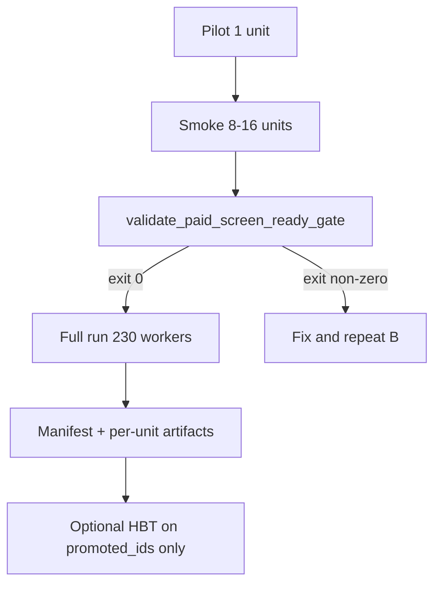

# VectorBT paid-compute screen runbook (Vast 256 vCPU)

Status: operational runbook for corrected VectorBT→HftBacktest discovery path.
Authority: [OPPORTUNITY_RESEARCH_SPEC.md](OPPORTUNITY_RESEARCH_SPEC.md), [VECTORBT_SCREENING_ENGINE_SPEC.md](VECTORBT_SCREENING_ENGINE_SPEC.md), [RESEARCH_ENTRYPOINTS.md](../vault/RESEARCH_ENTRYPOINTS.md).

**Do not** use `run_event_universe` as broad discovery on rented compute. Paid rent starts only after gated pilot + smoke passes.

**After smoke passes:** follow [VBT_PAID_SCREEN_POST_GATE_PLAYBOOK.md](VBT_PAID_SCREEN_POST_GATE_PLAYBOOK.md) (pre-rent checklist → Vast → completion). Run `python scripts/vbt_paid_screen_next_steps.py` for the current phase and exact next commands.

## Fable discipline (every phase)

1. **Ground** — read manifest, `events.csv` hash, git `HEAD`, NPZ path env vars.
2. **Reason** — declare `expected_work_units` before spawn; no post-hoc row-count completion.
3. **Act** — one phase at a time; no skipping smoke gate.
4. **Observe** — terminal manifest + per-unit `screening_artifact.json`, not JSONL alone.
5. **Verify** — `validate_paid_screen_ready_gate.py` + pytest lookahead subset.
6. **Report** — [VALIDATION_HONESTY.md](../VALIDATION_HONESTY.md) status block; no GREEN without terminal artifacts.

## Phase map (no ambiguity)

| Phase | Where | Workers | Units | Rent? | Proceed only if |
|-------|-------|---------|-------|-------|-----------------|
| **A Pilot** | Workstation | 1 | 1 (`CPI_2024_09_11_TIGHT`) | No | Artifact validates; lookahead pytest green |
| **B Smoke** | Workstation or small Vast slice | 4–8 | 8–16 diverse units | Optional small | Gate script exit 0; zero unit `ERROR` |
| **C Gate** | Workstation | — | — | No | `paid_screen_ready_gate.json` written |
| **D Full** | Vast 256 vCPU | **≥230** | Stage A scope (see below) | **Yes** | `--ready-gate-file` from Phase C |
| **E Post-run** | Workstation | — | — | No | Manifest complete; quarantine import before cockpit |



## Phase A — Pilot (mandatory, local)

**Purpose:** Prove plumbing, Rust VectorBT (for later paid scope), artifact schema, and no-lookahead enforcement—not alpha.

```bash
export HFT3_REPO="$(pwd)"
bash scripts/install_vbt_hbt_handoff_verify_deps.sh

python scripts/run_pipeline.py \
  --thesis "Fade spread blowout after CPI surprise on MES using HYP_5" \
  --event-id CPI_2024_09_11_TIGHT \
  --vectorbt \
  --vectorbt-scope pilot \
  --no-llm \
  --repo-root "$HFT3_REPO"
```

**Expected exit code:** `2` (blocked downstream HBT opt-in) is **OK** if `screening_artifact.json` exists.

**Pilot artifact path:** `research_cards/pipeline_runs/<run_id>/screening_artifact.json`

**Pilot pass checklist (all required):**

| Check | Command / field |
|-------|-----------------|
| Schema | `python -c "from backtest_pipeline.src.vectorbt_adapter import validate_screening_artifact; ..."` |
| `screening_backend` | `vectorbt` |
| `no_lookahead_signal_shift_proof` | non-empty string |
| `screening_artifact_hash` | present |
| `events_csv_hash` / `lake_manifest_hash` | present |
| `license_review` | recorded |
| Lookahead tests | `pytest tests/test_vectorbt_adapter.py::TestFilterCandidates::test_same_close_jump_signal_does_not_enter_on_jump_close -q` |

Record pilot path:

```bash
export VBT_PILOT_ARTIFACT="$HFT3_REPO/research_cards/pipeline_runs/<run_id>/screening_artifact.json"
```

## Phase B — Smoke batch (mandatory before full rent)

**Purpose:** Same code path as full run at 8–16 units; measure throughput; catch NPZ/env failures; confirm no systematic leakage or schema drift.

### B1 Generate smoke units

```bash
python scripts/generate_vbt_paid_units_jsonl.py \
  --out runtime/reports/vbt_smoke_units.jsonl \
  --smoke-count 12 \
  --symbols MES.v.0,ES.v.0 \
  --event-types CPI,NFP \
  --model-id HYP_5
```

### B2 Run smoke orchestrator

```bash
export VBT_PAID_RUN_ID="paid_smoke_$(date -u +%Y%m%dT%H%M%SZ)"

python scripts/run_vectorbt_paid_screen.py \
  --units-jsonl runtime/reports/vbt_smoke_units.jsonl \
  --out "research_cards/pipeline_runs/${VBT_PAID_RUN_ID}" \
  --vectorbt-scope paid-compute \
  --workers 4 \
  --max-wall-clock-seconds 3600 \
  --no-llm
```

**Smoke pass checklist:**

| Check | Requirement |
|-------|-------------|
| Terminal manifest | `paid_screen_run_manifest.json` exists |
| `completed_work_units + skipped_work_units + failed_work_units == expected_work_units` | exact equality |
| `failed_work_units` | **0** (any ERROR blocks gate) |
| Per-unit artifacts | Each completed unit has `units/<unit_id>/screening_artifact.json` passing `validate_screening_artifact` |
| Throughput | Record `units_per_hour` in manifest; use for full-run ETA |
| `vectorbt_engine` | `rust` for `paid-compute` scope (smoke must use paid-compute scope) |

```bash
export VBT_SMOKE_MANIFEST="$HFT3_REPO/research_cards/pipeline_runs/${VBT_PAID_RUN_ID}/paid_screen_run_manifest.json"
```

## Phase C — Ready gate (blocks Phase D)

**No Vast full rent without this script exiting 0.**

```bash
python scripts/validate_paid_screen_ready_gate.py \
  --pilot-artifact "$VBT_PILOT_ARTIFACT" \
  --smoke-manifest "$VBT_SMOKE_MANIFEST" \
  --out runtime/reports/paid_screen_ready_gate.json

# Optional: run lookahead pytest inside gate (default on)
```

**Gate writes:** `runtime/reports/paid_screen_ready_gate.json` with `ready_for_full_run: true`, pilot/smoke hashes, pytest tail.

**Gate fails on:**

- Missing or invalid pilot/smoke artifacts
- `failed_work_units > 0` in smoke manifest
- Hash mismatch between pilot and smoke (`events_csv_hash`, `lake_manifest_hash`)
- `paid-compute` smoke units without `vectorbt_engine=rust`
- Lookahead pytest failures
- Missing `no_lookahead_signal_shift_proof` on any validated artifact

## Phase D — Full paid run (Vast 256 vCPU)

**Pre-rent declaration (write to `runtime/reports/vbt_full_run_declaration.json`):**

```json
{
  "host_vcpu": 256,
  "reserved_vcpu": 26,
  "workers_requested": 230,
  "expected_work_units": 423,
  "units_source": "research_cards/stage_a_full/stage_a_survivors.json expanded",
  "stall_minutes": 30,
  "abort_on_failed_units": true,
  "git_head": "<sha>",
  "events_csv_hash": "<from pilot>",
  "lake_manifest_hash": "<from pilot>"
}
```

### D1 Generate full unit manifest

From Stage A survivors (workstation with lake paths):

```bash
python scripts/generate_vbt_paid_units_jsonl.py \
  --from-stage-a-survivors research_cards/stage_a_full/stage_a_survivors.json \
  --events-csv packages/data_system/config/events.csv \
  --out runtime/reports/vbt_full_units.jsonl
```

Or explicit units file maintained by owner.

### D2 Vast host setup

```bash
git clone / sync hft3
git submodule update --init vendor/openfoundry vendor/alphageometry
bash scripts/install_vbt_hbt_handoff_verify_deps.sh
pip install 'vectorbt[rust]==1.0.0'
export HFT3_NPZ_ROOT=/path/to/npz   # must match manifest
export HFT3_MANIFEST_PATH=/path/to/manifest.json
```

### D3 Execute (tmux)

```bash
export VBT_FULL_RUN_ID="paid_full_$(date -u +%Y%m%dT%H%M%SZ)"

python scripts/run_vectorbt_paid_screen.py \
  --units-jsonl runtime/reports/vbt_full_units.jsonl \
  --out "research_cards/pipeline_runs/${VBT_FULL_RUN_ID}" \
  --vectorbt-scope paid-compute \
  --workers 230 \
  --ready-gate-file runtime/reports/paid_screen_ready_gate.json \
  --max-wall-clock-seconds 86400 \
  --stall-minutes 30 \
  --no-llm
```

**Full run refuses to start** without `--ready-gate-file` when `--workers > 16` (unless `--owner-waiver` with reason string).

### D4 Stall monitor (supervisor shell)

While workers run, every 5 minutes:

```bash
python scripts/validate_paid_screen_ready_gate.py --watch-manifest \
  "research_cards/pipeline_runs/${VBT_FULL_RUN_ID}/paid_screen_run_manifest.json" \
  --stall-minutes 30
```

If stalled: capture `ps`, `iostat`, last 20 log lines; kill worker pool; preserve checkpoint; **do not** cockpit-import partial results as GREEN.

## Phase E — Completion (what “backtest complete” means)

**VectorBT paid screen is complete when:**

1. `paid_screen_run_manifest.json` shows `status=complete`.
2. `expected_work_units == completed + skipped + failed` (skipped must have reasons).
3. Every `completed` unit: `validate_screening_artifact()` passes on `units/<unit_id>/screening_artifact.json`.
4. Import quarantine: copy manifest + units to workstation; run gate validator on full manifest sample (min 10 random units).
5. Cockpit aggregation only after step 4.

**Not complete:**

- JSONL row files without manifest
- `failed_work_units > 0` without owner acceptance
- Partial import (333-row lesson)

**Downstream (separate job, smaller scope):**

- Aggregate `promoted_ids` from all unit artifacts: `python scripts/aggregate_vbt_promoted_ids.py --manifest <full_manifest>`
- HBT realism on promoted only — [RESEARCH_ENTRYPOINTS.md](../vault/RESEARCH_ENTRYPOINTS.md) §1.
- M6 `run_event_universe` only on selected promoted IDs — not discovery.

## Error → action matrix

| Symptom | Phase | Action |
|---------|-------|--------|
| Exit 2, artifact exists | A/B | Expected without `--hftbacktest-realism`; verify artifact |
| `Rust VectorBT required` | B/D | Install `vectorbt[rust]`; confirm scope |
| Unit `ERROR` NPZ missing | B | Fix `HFT3_NPZ_ROOT`; mark unit SKIP in manifest; do not start D until B is 0 failures |
| `failed_work_units > 0` | C | Do not rent; fix root cause; re-smoke |
| Gate hash mismatch | C | Re-sync repo/events.csv/manifest; re-pilot |
| Workers idle, CPU low | D | Profile I/O; document bottleneck; only then reduce workers below 230 |
| Manifest stuck | D | Stall rule → kill; resume with `--resume` if checkpoint compatible |
| `LOOKAHEAD_PROOF_FAILED` in artifact | Any | **Stop**; fix `vectorbt_adapter` shift; re-pilot |

## Verification commands (scope-green for this lane)

```bash
bash scripts/run_vbt_hbt_handoff_verify.sh
pytest tests/test_vectorbt_paid_screen_gate.py -q
pytest tests/test_vectorbt_adapter.py::TestFilterCandidates::test_same_close_jump_signal_does_not_enter_on_jump_close -q
```

## Honest status template

```text
merge-ready: no until full manifest validated
scope-green: run_vbt_hbt_handoff_verify.sh + paid screen gate tests
phase: A|B|C|D|E
pilot-artifact: <path>
smoke-manifest: <path>
ready-gate: <path> exit <code>
full-manifest: <path or pending>
known-gaps: <CHI404 live, HBT on promoted, cockpit import>
```
